```{r setup, include=FALSE}
knitr::opts_chunk$set(echo = FALSE)
```

## Git

- Git est un logiciel de gestion de versions décentralisé.

```{r, out.height= "500px", out.width= "400px"}
knitr::include_graphics("images/git_explained.jpg")
```


## GitHub

- GitHub est un service web d'hébergement et de gestion de développement de logiciels, utilisant le logiciel de gestion de versions Git.


## Prérequis

Avoir installé :

- R
- Rstudio
- git

## Se connecter sur GitHub

[github.com](github.com)

## Créer un repo sur GitHub

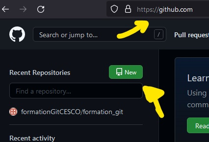{width=500px}

## Créer un repo sur GitHub

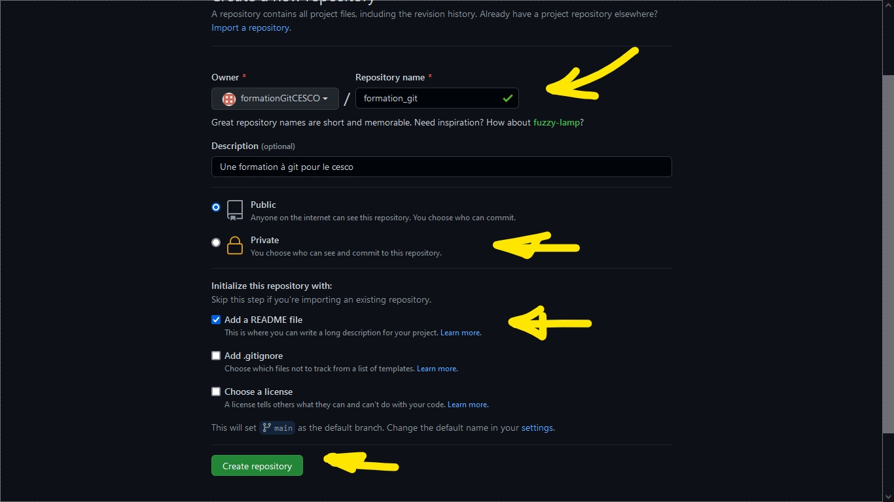{width=900px}

## Créer un repo sur GitHub

Résumé :

- Cliquer sur **new**
- Donner un **titre**
- Choisir le type de repo
  - Public
  - **Private** (sans doute mieux dans un premier temps au moins)
- Ajouter un **README**
- cliquer sur **Create repository**

## Créer un projet dans Rstudio

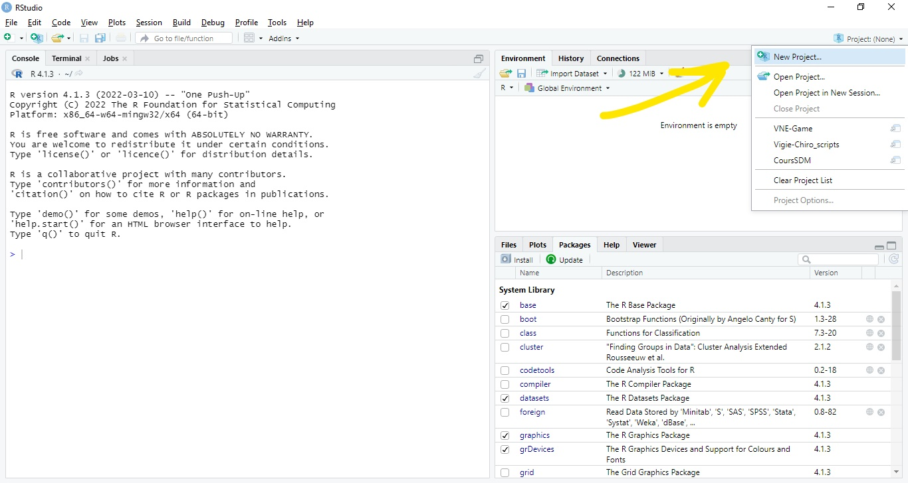{width=800px}

## Créer un projet dans Rstudio

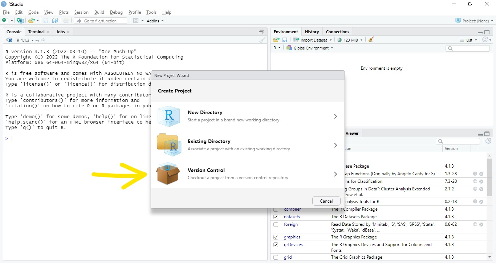{width=800px}

## Créer un projet dans Rstudio

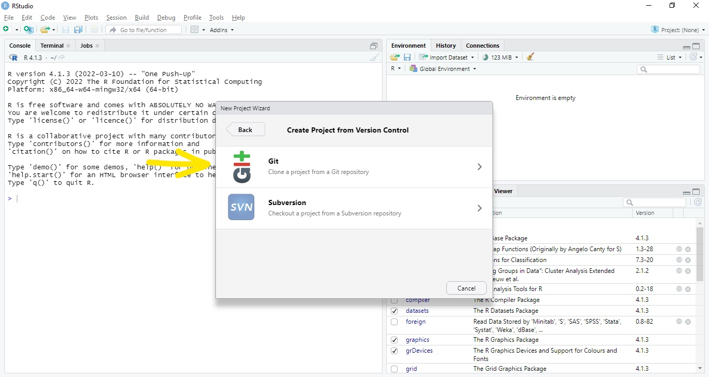{width=800px}

## Créer un projet dans Rstudio

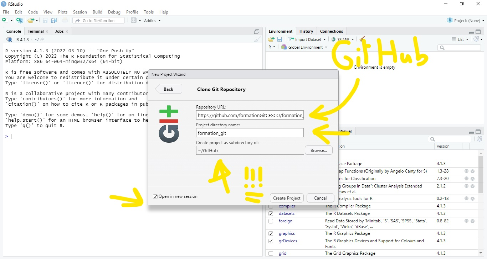{width=800px}

## Retour à GitHub

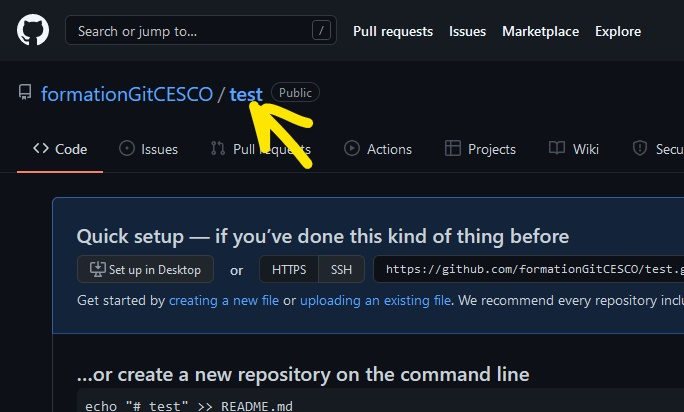{width=900px}

## Retour à GitHub

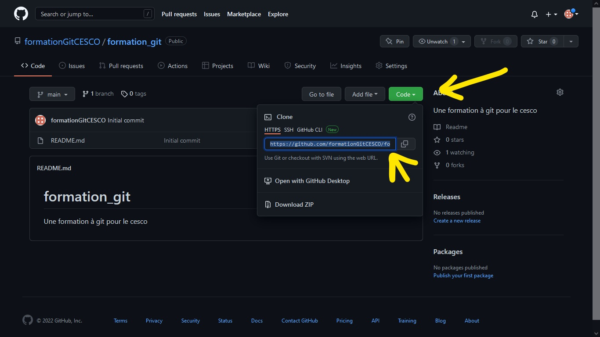{width=900px}

## Créer un projet dans Rstudio

{width=800px}

## Créer un projet dans Rstudio

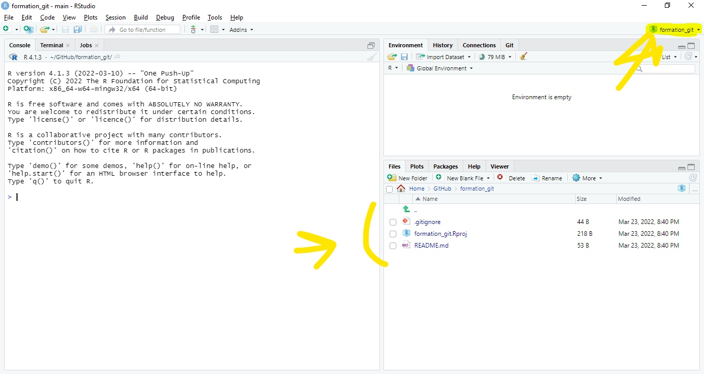{width=800px}

## Aller voir notre dossier

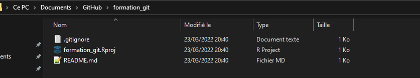{width=800px}

## Créer un projet dans Rstudio

Résumé :

- Cliquer sur **New project...**
- Cliquer sur **Version Control**
- Cliquer sur **git**
- Copier l'URL du repo GitHub
- Ouvrir dans une nouvelle session

## Ranger son dossier à versionner

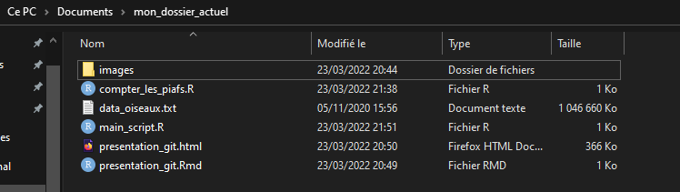{width=800px}

## Ranger son dossier à versionner

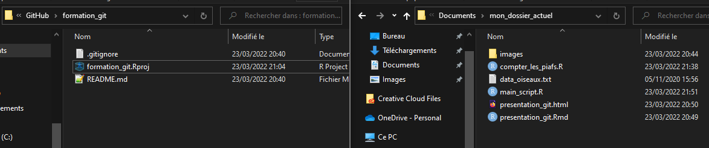{width=800px}

## Ranger son dossier à versionner

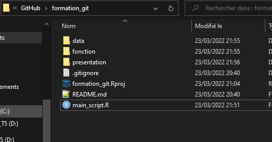{width=800px}


## Ranger son dossier à versionner

- **ATTENTION AUX DONNEES PERSONNELLES ET SENSIBLES**
- Mettez les données dans un dossier
- Suivez votre logique mais attention à bien nommer ses fichiers et dossiers

## Retour dans R

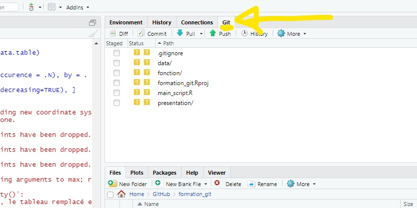{width=800px}

## Git add

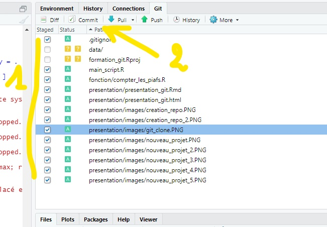{width=800px}

## Git commit

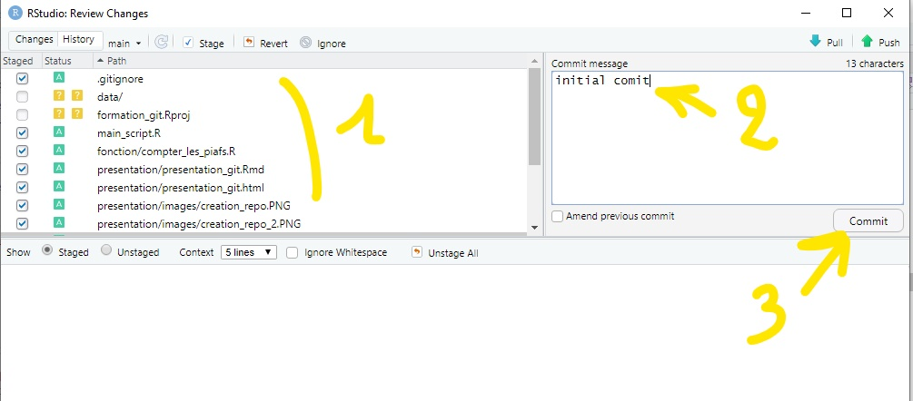{width=800px}

## gitignore

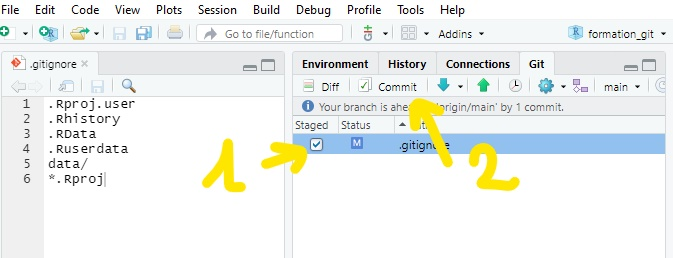{width=800px}

## git add / git diff/ git commit

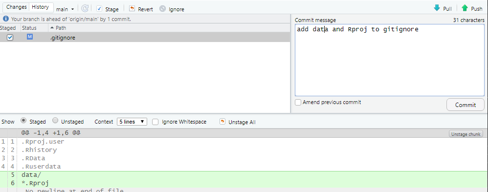{width=800px}

## git history

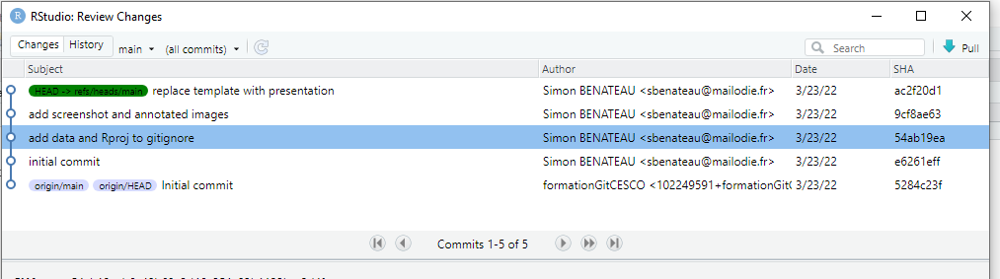

## git push (GitHub)

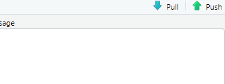

## git push (GitHub)

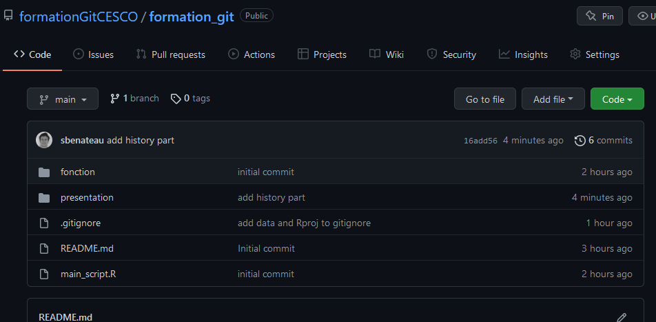

## add collaborators

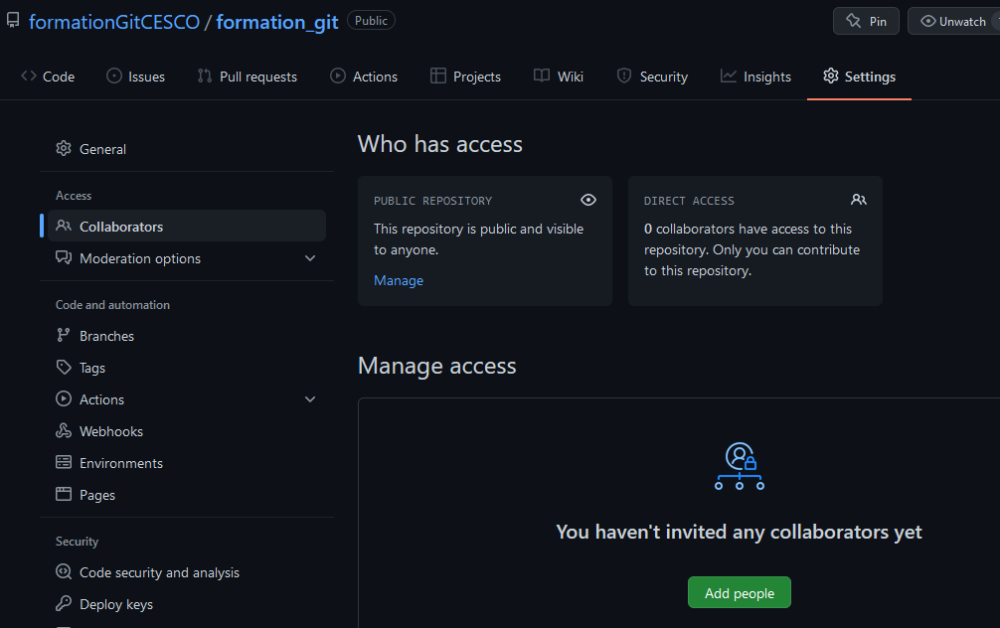

## add collaborators

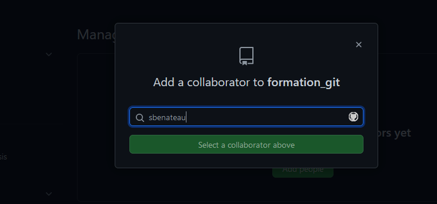
